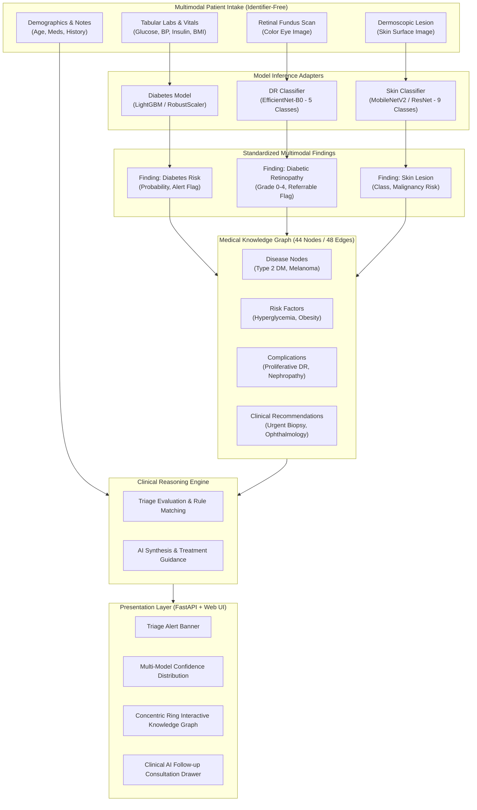

# Multimodal Clinical Decision Support System & Knowledge Layer

[](https://fastapi.tiangolo.com/)
[](https://www.python.org/)
[](https://pytorch.org/)

A multimodal clinical decision support platform combining deep learning computer vision, tabular biomarker risk modeling, an interactive medical knowledge graph, and AI clinical synthesis. AURA-MED provides explainable, guideline-backed diagnostic recommendations and emergency triage screening across metabolic, ophthalmologic, and dermatologic clinical domains.

---

## Table of Contents

- [Key Capabilities](#key-capabilities)
- [System Architecture](#system-architecture)
- [Model Zoo & Validation](#model-zoo--validation)
  - [1. Tabular Diabetes Risk Classifier (Pima)](#1-tabular-diabetes-risk-classifier-pima)
  - [2. Diabetic Retinopathy Classifier (Retinal Fundus)](#2-diabetic-retinopathy-classifier-retinal-fundus)
  - [3. Skin Lesion Classifier (Dermoscopy)](#3-skin-lesion-classifier-dermoscopy)
- [Medical Knowledge Graph](#medical-knowledge-graph)
  - [Ontology & Concentric Ring Topology](#ontology--concentric-ring-topology)
  - [Active Decision Pathways](#active-decision-pathways)
- [Data Intake & JSON Upload Specification](#data-intake--json-upload-specification)
  - [JSON Schema](#json-schema)
  - [Field Dictionary](#field-dictionary)
  - [Image Upload Guidelines](#image-upload-guidelines)
- [Web Application & UI Features](#web-application--ui-features)
  - [Clean Clinical Aesthetic](#clean-clinical-aesthetic)
  - [Interactive Knowledge Graph Visualizer](#interactive-knowledge-graph-visualizer)
  - [Clinical AI Follow-up Consultation](#clinical-ai-follow-up-consultation)
- [REST API Reference](#rest-api-reference)
- [Directory Structure](#directory-structure)
- [Installation & Quickstart](#installation--quickstart)
  - [1. Environment Setup](#1-environment-setup)
  - [2. Install Dependencies](#2-install-dependencies)
  - [3. Configuration (.env)](#3-configuration-env)
  - [4. Model Weights](#4-model-weights)
  - [5. Retrain / Verify Diabetes Model](#5-retrain--verify-diabetes-model)
  - [6. Launch the Application](#6-launch-the-application)
- [Testing & Verification](#testing--verification)
- [Safety, Ethics & Clinical Disclaimer](#safety-ethics--clinical-disclaimer)

---

## Key Capabilities

- **Tri-Modal Clinical Synthesis**: Concurrently processes tabular blood lab biomarkers, high-resolution retinal fundus photography, and dermoscopic skin lesion images.
- **Explainable Decision Paths**: Correlates patient findings against a curated 44-node / 48-edge medical knowledge graph to trace clinical reasoning from root disease to urgent intervention.
- **Leakage-Free Modeling**: Retrained, split-first training pipeline for Pima diabetes classification that eliminates target leakage and provides verified out-of-fold generalization.
- **Automated Triage Alerts**: Immediately surfaces critical flags (e.g., referrable Grade 3/4 Diabetic Retinopathy, suspected Melanoma, acute hyperglycemia) with prioritized clinical actions.
- **Interactive Full-Screen Graph Canvas**: Visualizes the entire clinical ontology arranged in concentric rings with mouse-wheel zoom, click-and-drag panning, repositionable nodes, and full-screen inspection.
- **Follow-up AI Consultation**: Enables attending clinicians or users to interrogate findings, explore medication interactions, and clarify recommendations in an interactive conversational drawer.
- **Privacy-First Design**: Completely identifier-free (no patient ID storage or tracking); all inference operates statelessly on clinical biomarkers and diagnostic scans.

---

## System Architecture



---

## Model Zoo & Validation

### 1. Tabular Diabetes Risk Classifier (Pima)

- **Target Task**: Binary classification of 5-year diabetes onset based on 8 diagnostic parameters (Pregnancies, Glucose, Blood Pressure, Skin Thickness, Insulin, BMI, Diabetes Pedigree Function, Age).
- **Target Leakage Remediation**:
  - *Previous Defect*: Earlier benchmark notebooks applied median imputation grouped by `Outcome` across the entire dataset before train/test split. Approximately 49% of Insulin and Skin Thickness entries were imputed with outcome-dependent constants, resulting in artificially inflated scores (AUC 0.945) unachievable at deployment.
  - *Remediation (`pima_fixed_training.py`)*:
    - Split-first protocol: Training and hold-out test sets (80/20) partitioned with stratification prior to imputation.
    - Zero values in physiological markers (`Glucose`, `BloodPressure`, `SkinThickness`, `Insulin`, `BMI`) converted to `NaN` and imputed using training-set medians only.
    - SMOTETomek resampling applied strictly inside cross-validation training folds.
    - Champion Model: **LightGBM / Gradient Boosting** evaluated with 5-fold Stratified CV.
    - Real-world Hold-out Performance: **AUC 0.835 – 0.852**, Accuracy 77–80%, F1 0.71–0.74.

### 2. Diabetic Retinopathy Classifier (Retinal Fundus)

- **Architecture**: `EfficientNet-B0` with custom classification head (Dropout 0.35 -> Linear 256 -> ReLU -> Dropout 0.25 -> Linear 5).
- **Classes (5)**:
  - `0`: No DR
  - `1`: Mild Non-Proliferative DR (NPDR)
  - `2`: Moderate NPDR
  - `3`: Severe NPDR
  - `4`: Proliferative DR (PDR)
- **Validation Metric**: **Quadratic Weighted Kappa (QWK) = 0.9116**.
- **Clinical Policy**: Predictions with Grade $\ge 2$ trigger *Referrable Diabetic Retinopathy*, generating an immediate automated alert for urgent ophthalmologic referral.

### 3. Skin Lesion Classifier (Dermoscopy)

- **Architecture**: Deep convolutional classifier (`MobileNetV2` / `ResNet`) trained on dermoscopic datasets (HAM10000).
- **Classes (9)**:
  - `Actinic keratosis` (Premalignant)
  - `Atopic Dermatitis` (Benign)
  - `Benign keratosis` (Benign)
  - `Chickenpox` (Benign / Viral)
  - `Epidermolysis Bullosa` (Genetic)
  - `Melanoma` (Malignant)
  - `Normal Skin`
  - `Squamous cell carcinoma` (Malignant)
  - `Tinea Ringworm Candidiasis` (Fungal)
- **Malignancy Policy**: Aggregates probabilities across `Melanoma`, `Squamous cell carcinoma`, and `Actinic keratosis`. If aggregate probability exceeds 0.40, a high-severity alert is issued recommending a dermatologist biopsy.

---

## Medical Knowledge Graph

The system features a 44-node, 48-edge medical ontology (`kg_relationships.json`) managed with NetworkX (`medical_kg.py`).

### Ontology & Concentric Ring Topology

Nodes are arranged into six concentric clinical domains to ensure structured, overlap-free visual navigation:

| Ring Level | Domain | Color Code | Node Examples |
|:---|:---|:---|:---|
| **Ring 1 (Center)** | **Diseases** | Red (`#ef4444`) | `diabetes_t2`, `diabetic_retinopathy`, `melanoma`, `hypertension` |
| **Ring 2** | **Risk Factors** | Amber (`#f59e0b`) | `hyperglycemia`, `obesity`, `advanced_age`, `family_history_dm` |
| **Ring 3** | **Findings** | Blue (`#3b82f6`) | `dr_grade0` to `dr_grade4`, `normal_skin` |
| **Ring 4** | **Complications**| Pink (`#ec4899`) | `diabetic_nephropathy`, `diabetic_foot`, `cardiovascular_disease` |
| **Ring 5** | **Drugs & Interventions** | Green (`#10b981`) | `metformin`, `insulin_therapy`, `anti_vegf`, `laser_photocoag` |
| **Ring 6 (Outer)** | **Recommendations** | Purple (`#8b5cf6`)| `rec_fundus_urgent`, `rec_biopsy`, `rec_glucose_control` |

### Active Decision Pathways

When patient findings are generated, `server.py` executes `_compute_active_subgraph()`, linking predicted findings to corresponding disease states, complications, and recommended actions. The web visualizer renders these active pathways with an animated neon aura:

```
[Hyperglycemia + Glucose 148] ──> [Type 2 Diabetes] ──> [Diabetic Retinopathy Grade 3]
                                         │                            │
                                         ▼                            ▼
                            [Optimize Glycemic Control]    [Urgent Ophthalmology Referral]
```

---

## Data Intake & JSON Upload Specification

Users can populate clinical data manually, import sample profiles, or upload a formatted JSON file. All intake is strictly identifier-free.

### JSON Schema

```json
{
  "patient": {
    "age": 55,
    "sex": "female",
    "clinical_notes": "Patient presents with fatigue, polyuria, and blurry vision in left eye.",
    "known_conditions": [
      "hypertension"
    ],
    "medications": [
      "metformin",
      "amlodipine"
    ]
  },
  "tabular_data": {
    "Pregnancies": 3,
    "Glucose": 168.0,
    "BloodPressure": 82.0,
    "SkinThickness": 28.0,
    "Insulin": 145.0,
    "BMI": 33.4,
    "DiabetesPedigreeFunction": 0.672,
    "Age": 55
  }
}
```

### Field Dictionary

| Key Path | Data Type | Units / Format | Description & Clinical Validation |
|:---|:---:|:---:|:---|
| `patient.age` | Integer | Years (1–120) | Patient chronological age. |
| `patient.sex` | String | `"female" \| "male" \| "other"` | Biological sex. |
| `patient.clinical_notes` | String | Free-text | Symptoms, clinical presentation, and history notes. |
| `patient.known_conditions` | Array of Strings | Free-text list | Diagnosed conditions (e.g. `["hypertension"]`). |
| `patient.medications` | Array of Strings | Free-text list | Current medications (e.g. `["metformin", "lisinopril"]`). |
| `tabular_data.Pregnancies` | Integer | Count ($\ge 0$) | Number of pregnancies (`0` for male patients). |
| `tabular_data.Glucose` | Float | mg/dL | Fasting or 2-hour plasma glucose concentration. |
| `tabular_data.BloodPressure` | Float | mm Hg | Diastolic blood pressure. |
| `tabular_data.SkinThickness` | Float | mm | Triceps skin fold thickness (`0` if unavailable). |
| `tabular_data.Insulin` | Float | $\mu\text{U/mL}$ | 2-Hour serum insulin (`0` if unavailable). |
| `tabular_data.BMI` | Float | $\text{kg/m}^2$ | Body Mass Index ($\text{weight} / \text{height}^2$). |
| `tabular_data.DiabetesPedigreeFunction` | Float | Score (0.0–2.5) | Genetic risk pedigree score. |
| `tabular_data.Age` | Integer | Years | Age entry for tabular feature vector. |

### Image Upload Guidelines

- **Eye Image (Retinal Fundus)**:
  - Formats: `.jpg`, `.jpeg`, `.png`
  - Specifications: High-quality fundus photograph with visible optic disc and macula (normalized to $224 \times 224$ via ImageNet statistics).
- **Skin Lesion Image (Dermoscopy)**:
  - Formats: `.jpg`, `.jpeg`, `.png`
  - Specifications: Close-up dermoscopic or macro clinical photograph centered on the primary lesion.

---

## Web Application & UI Features

The frontend is served directly by FastAPI as a high-performance single page application (`index.html`, `style.css`, `app.js`).

### Clean Clinical Aesthetic
- **Zero Emojis or Decorative AI Icons**: Streamlined typography (`Inter` & `Outfit`), standard geometric SVG indicators, and clinical status pills.
- **Dynamic Biomarker Badges**: Visual warnings appear automatically when values exceed clinical thresholds (e.g., Glucose > 140 mg/dL, BMI > 30.0).
- **Triage Alert Banner**: Pulsing alert container highlighting urgent referral obligations.
- **Multi-Class Probability Breakdown**: Detailed horizontal probability distribution bars for each model prediction.

### Interactive Knowledge Graph Visualizer
- **Mouse Wheel Zoom**: Smooth cursor-focal zoom in and zoom out.
- **Pan & Move**: Click-and-drag panning across an infinite canvas with `grab` and `grabbing` cursor states.
- **Node Repositioning**: Interactive drag-and-drop allows repositioning any node to inspect dense relationship clusters.
- **Full Screen Mode**: Dedicated full-screen modal with high-DPI canvas re-rendering, zoom reset, and keyboard shortcut (`Escape` to exit).

### Clinical AI Follow-up Consultation
- Embedded chat assistant (`Dr. AI` persona) connected directly to the active diagnosis report.
- Full context over patient lab values, model confidences, active knowledge graph pathways, and prior recommendations.
- Quick prompts for immediate clinician inquiries (*"Why urgent ophthalmology?"*, *"Explain skin lesion finding"*, *"Should patient continue metformin?"*).

---

## REST API Reference

All endpoints return standard JSON responses and are documented via interactive Swagger UI at `/docs`.

| Method | Endpoint | Description | Request Payload | Response Highlights |
|:---|:---|:---|:---|:---|
| `GET` | `/` | Web Application UI | None | `text/html` dashboard. |
| `GET` | `/api/health` | System health check | None | Model statuses, AI engine status, KG node count. |
| `GET` | `/api/sample` | Sample patient data | None | Clean sample JSON data for testing. |
| `GET` | `/api/json-template` | JSON schema specification | None | Full JSON template & field dictionary. |
| `GET` | `/api/download-template` | Download JSON template | None | File download: `patient_template.json`. |
| `GET` | `/api/kg` | Knowledge Graph ontology | None | Array of `nodes`, `edges`, and `clinical_rules`. |
| `POST` | `/api/analyze` | Multimodal analysis pipeline | `multipart/form-data`: `patient_json` OR form fields + `eye_image` + `skin_image` | `findings`, `triage_alerts`, `clinical_summary`, `recommendations`, `active_kg`. |
| `POST` | `/api/chat` | AI follow-up assistant | `application/json`: `{"message": "...", "report": {...}, "history": [...]}` | `{"reply": "...", "timestamp": "..."}` |

---

## Directory Structure

```
knowledge_layer/
├── README.md                           <- Master project documentation (this file)
├── server.py                           <- FastAPI backend service & static server
├── run_pipeline.py                     <- CLI entrypoint for batch multimodal execution
├── pima_fixed_training.py              <- Leakage-free training script for Pima model
├── adapters.py                         <- Inference adapters (Tabular, Fundus, Skin)
├── medical_kg.py                       <- NetworkX medical knowledge graph manager
├── kg_relationships.json               <- 44-node / 48-edge clinical ontology definition
├── reasoner.py                         <- AI Clinical Reasoning Engine + offline fallback
├── schema.py                           <- Pydantic models & dataclass definitions
├── config.py                           <- Configuration, thresholds, and filepaths
├── test_knowledge_layer.py             <- Comprehensive unittest test suite (35 tests)
│
├── requirements.txt                    <- Core backend & ML requirements
├── requirements-images.txt             <- PyTorch & torchvision dependencies
├── .env.example                        <- Environment configuration template
├── .env                                <- Local environment configuration
│
├── static/                             <- Frontend Web Assets
│   ├── index.html                      <- Single-page clinical dashboard
│   ├── style.css                       <- Clinical dark theme & full-screen canvas
│   └── app.js                          <- UI state, canvas rendering, pan/zoom, chat
│
├── models/                             <- Local model checkpoints
│   ├── diabetes_model.joblib           <- Retrained leakage-free Pima pipeline
│   ├── best_dr_model.pth               <- Trained EfficientNet-B0 DR model (QWK 0.9116)
│   └── best_skin_model.pth             <- Trained skin disease classifier
│
├── data/                               <- Tabular datasets
│   └── pima-indians-diabetes.csv       <- Pima Indians Diabetes dataset
│
└── samples/                            <- Verification and demo assets
    ├── patient_example.json            <- Sample intake file
    ├── eye.png                         <- Sample retinal fundus scan
    └── lesion.jpg                      <- Sample dermoscopic skin scan
```

---

## Installation & Quickstart

### 1. Environment Setup

Ensure you are running **Python 3.10** or newer:

```powershell
# Navigate to the knowledge_layer directory
cd C:\Users\kshit\Downloads\Project\knowledge_layer

# Create virtual environment
python -m venv venv

# Activate on Windows PowerShell
.\venv\Scripts\Activate.ps1
```

### 2. Install Dependencies

Install core dependencies (FastAPI, scikit-learn, LightGBM, NetworkX, Pillow):

```powershell
pip install -r requirements.txt
```

Next, install PyTorch and torchvision. If you have an NVIDIA GPU, install the corresponding CUDA wheel:

```powershell
# For CPU-only:
pip install -r requirements-images.txt --extra-index-url https://download.pytorch.org/whl/cpu

# For CUDA 11.8:
pip install -r requirements-images.txt --extra-index-url https://download.pytorch.org/whl/cu118

# For CUDA 12.1:
pip install -r requirements-images.txt --extra-index-url https://download.pytorch.org/whl/cu121
```

### 3. Configuration (.env)

Create a `.env` file inside `knowledge_layer/`:

```env
# Google GenAI API Key for online AI reasoning and Dr. AI chatbot
GEMINI_API_KEY=your_api_key_here
GEMINI_MODEL=gemini-2.5-flash-lite

# Clinical Thresholds
DIABETES_ALERT_THRESHOLD=0.50
DR_REFERABLE_GRADE=2
SKIN_MALIGNANT_THRESHOLD=0.40

# Server logging
LOG_LEVEL=INFO
```

> **Note**: If `GEMINI_API_KEY` is omitted, the system seamlessly transitions to its built-in rule-based clinical engine and conservative offline chatbot.

### 4. Model Weights

Place your trained model files into `knowledge_layer/models/`:

- `best_dr_model.pth` — EfficientNet-B0 Diabetic Retinopathy weights
- `best_skin_model.pth` — Skin disease classifier weights
- `diabetes_model.joblib` — Retrained diabetes pipeline

### 5. Retrain / Verify Diabetes Model

To retrain the diabetes model without target leakage:

```powershell
python pima_fixed_training.py
```

This trains the pipeline with split-first imputation, evaluates via 5-fold Stratified CV, and exports the final artifact to `models/diabetes_model.joblib`.

### 6. Launch the Application

Start the FastAPI application with Uvicorn:

```powershell
python -m uvicorn server:app --host 127.0.0.1 --port 8000 --reload
```

Open your browser and navigate to:
**[http://127.0.0.1:8000](http://127.0.0.1:8000)**

---

## Testing & Verification

Run the comprehensive unit test suite:

```powershell
python -m unittest test_knowledge_layer.py
```

All 35 tests validate schema contracts, knowledge graph queries, adapter loads, offline reasoner fallbacks, and full pipeline integration.

### CLI Batch Pipeline Verification

Run the end-to-end multimodal pipeline directly from the command line:

```powershell
python run_pipeline.py --input samples/patient_example.json --no-images
```

---

## Safety, Ethics & Clinical Disclaimer

> **IMPORTANT MEDICAL NOTICE**
> 
> AURA-MED is an experimental **Clinical Decision Support (CDS) research prototype** intended solely for investigational, educational, and workflow evaluation purposes.
> 
> 1. **Not Autonomous Diagnosis**: Outputs produced by this system (including ML confidence scores, knowledge graph pathways, and AI-generated summaries) do **not** constitute medical diagnoses, clinical treatment plans, or emergency directives.
> 2. **Physician Oversight Required**: All findings must be independently validated by a licensed physician or specialist before clinical action.
> 3. **Identifier-Free & Stateless**: The system deliberately does not store patient identification records, promoting patient privacy and compliance with data governance standards.
